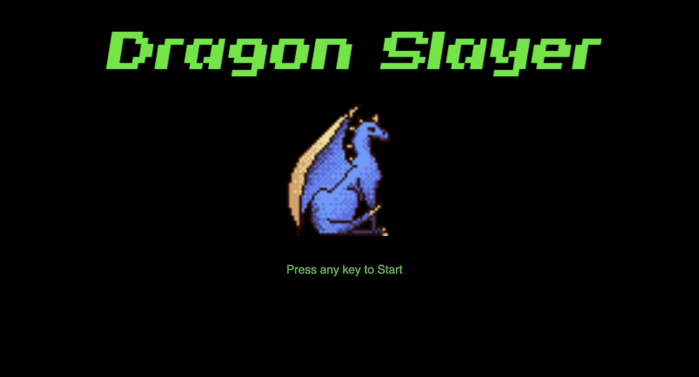
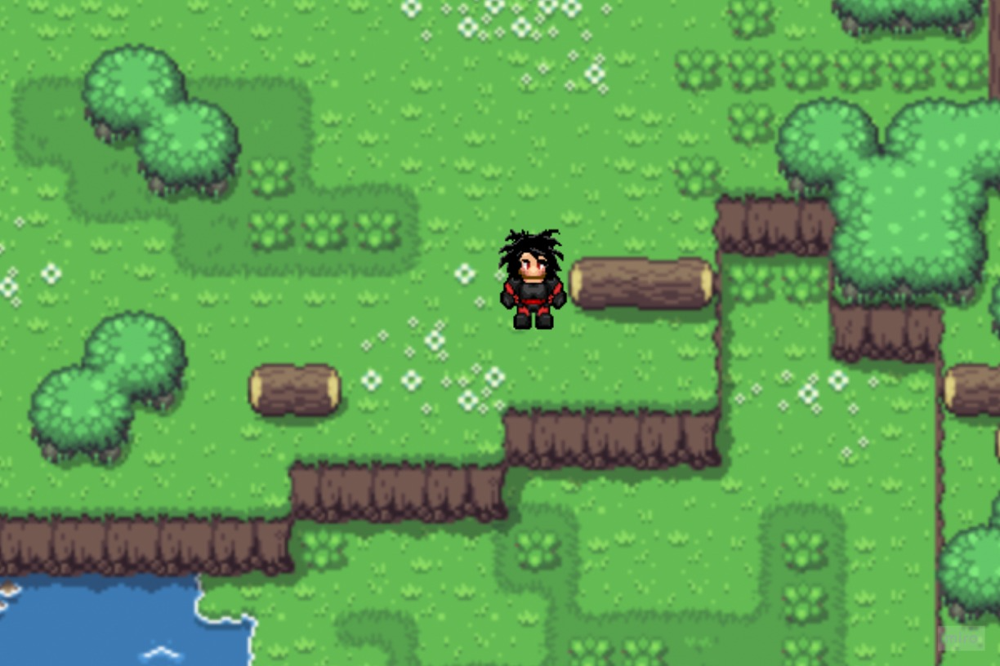

# Dragon Slayer RPG

## Overview
---
I picked to build an old-school RPG inspired by my first favorite game, Dragon Warrior on NES.

## Game Rules
---
The game is played by moving your character around a map until you run into a monster. After the monster is encountered, you will move to a separate battle screen, where you will have options to battle the monster and earning experience points. You will level up once reaching a certain amount of experience, which will allow you to fight a different monster. At a certain level, you will unlock a boss fight.

To win the game, you must defeat the boss.

You can lose the game by having your Health Points drop to 0. 

## Wireframes
---

1) Start Screen - this will be the load screen that will allow you to begin a new game.

2) Exploration Screen - on this screen you will explore the map and run into monsters to fight

3) Battle Screen - when you come in contact with a monster, you will switch to the battle screen for a fight

## User stories
---

- When i press any key at the start screen, the screen changes, the game begins.
- In the exploration screen, I can move my character around the map.
- On the map, there are monsters moving around. 
- The type of monsters on the map vary with the player's level.
- When I defeat a monster, I will gain EXP points. 
- At specified levels of EXP, I will reach a new player level.
- I will receive boosts to my Health Points (HP) and Attack Points (AP) range as I level up.
- Monsters at higher levels wil have higher HP and AP as well.
- Once I reach level 5, I will be able to access the boss fight.
- If i defeat the boss, I will win the game.
- If my HP hits zero, the game will end and I will start over. 

## MVP checklist
---

- Battle system will function so that player can attack and damage monster, and vice versa. Monster or player dies when HP reaches 0.
- Level up system will function to improve both player stats and monster stats. Player's HP will reset to full upon level up.
- Player sprite will be able to move across the map screen using keyboard inputs
- Player will win game after defeating Boss

## Stretch goals
---

- When I level up, I can learn spells (healing or attack) and gain MP (magic points)
- When I defeat a monster, I will earn gold.
- Gold can be used to purchase potions or upgrade equipment.
- There can be impassable objects on the map such as mountains or water